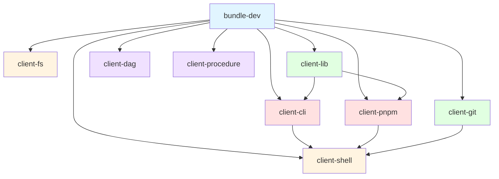
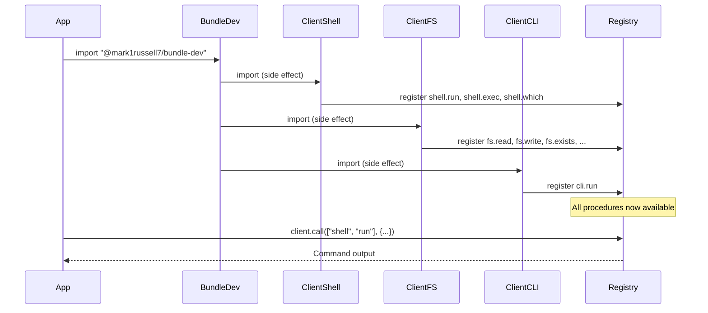

# @mark1russell7/bundle-dev


Development workflow bundle that aggregates multiple client packages into a single dependency for streamlined package development workflows.

## Overview

`bundle-dev` is a **meta-package** that imports and registers procedures from multiple client packages. It serves as a convenient single dependency that provides access to all development workflow operations including shell execution, filesystem operations, CLI tools, package management, and version control.

This package follows the **Bundle Package Pattern** - it contains no procedures of its own, but rather re-exports and auto-registers procedures from its dependencies through side-effect imports.

### Key Characteristics

- **Zero Logic**: Contains no procedure implementations, only imports
- **Auto-Registration**: Procedures are registered automatically via side-effect imports
- **Single Dependency**: One package to install for complete dev workflow access
- **Type-Safe**: Full TypeScript support with all imported procedure types

## Architecture



### Package Layers

```
┌─────────────────────────────────────────────────────────────────┐
│  bundle-dev (THIS PACKAGE)                                      │
│  - Aggregates all dev-related client packages                   │
│  - Single dependency for dev workflows                          │
└───────────────────────────────┬─────────────────────────────────┘
                                │
┌───────────────────────────────▼─────────────────────────────────┐
│  Client Packages                                                │
│  - client-cli: Mark CLI wrapper                                 │
│  - client-pnpm: pnpm package manager wrapper                    │
│  - client-lib: Library management                               │
│  - client-git: Git operations                                   │
│  - client-dag: Dependency graph analysis                        │
│  - client-procedure: Procedure introspection                    │
└───────────────────────────────┬─────────────────────────────────┘
                                │
┌───────────────────────────────▼─────────────────────────────────┐
│  Foundation Packages                                            │
│  - client-shell: Generic shell execution                        │
│  - client-fs: Filesystem operations                             │
└─────────────────────────────────────────────────────────────────┘
```

## Installation

```bash
# Using pnpm (recommended)
pnpm add @mark1russell7/bundle-dev

# Using npm
npm install @mark1russell7/bundle-dev

# Via GitHub (development)
pnpm add github:mark1russell7/bundle-dev#main
```

## Usage

### Basic Import

Simply importing the package registers all procedures:

```typescript
import "@mark1russell7/bundle-dev";
// All procedures are now registered and available
```

### With Client API

```typescript
import { client } from "@mark1russell7/client";
import "@mark1russell7/bundle-dev";

// Shell operations
await client.call(["shell", "run"], {
  command: "echo Hello World",
  cwd: "/path/to/dir"
});

// Filesystem operations
const content = await client.call(["fs", "read"], {
  path: "/path/to/file.txt"
});

// CLI wrapper (mark CLI)
await client.call(["cli", "run"], {
  path: ["lib", "new"],
  positional: ["my-package"],
  args: { preset: "lib" }
});

// pnpm operations
await client.call(["pnpm", "install"], {
  packages: ["lodash"],
  dev: true,
  cwd: "/path/to/project"
});

// Library management
await client.call(["lib", "new"], {
  name: "my-lib",
  preset: "lib"
});

// Git operations
const status = await client.call(["git", "status"], {
  cwd: "/path/to/repo"
});

// Dependency graph
const graph = await client.call(["dag", "build"], {
  rootPath: "/path/to/monorepo"
});

// Procedure introspection
const procedures = await client.call(["procedure", "list"], {});
```

## Included Packages

### Core Infrastructure

#### [@mark1russell7/client-shell](https://github.com/mark1russell7/client-shell)
Generic shell command execution with cross-platform support.

**Procedures:**
- `shell.run` - Execute shell commands with output capture
- `shell.exec` - Execute commands without output capture
- `shell.which` - Locate executable binaries

#### [@mark1russell7/client-fs](https://github.com/mark1russell7/client-fs)
Filesystem operations for reading, writing, and manipulating files.

**Procedures:**
- `fs.read` - Read file contents
- `fs.write` - Write file contents
- `fs.exists` - Check file/directory existence
- `fs.mkdir` - Create directories
- `fs.remove` - Remove files/directories
- `fs.list` - List directory contents
- `fs.copy` - Copy files/directories
- `fs.move` - Move files/directories

### CLI Wrappers

#### [@mark1russell7/client-cli](https://github.com/mark1russell7/client-cli)
Wrapper for the Mark CLI tool with path-based command structure.

**Procedures:**
- `cli.run` - Execute Mark CLI commands

**Example:**
```typescript
// Equivalent to: mark lib new my-package --preset lib
await client.call(["cli", "run"], {
  path: ["lib", "new"],
  positional: ["my-package"],
  args: { preset: "lib" }
});
```

#### [@mark1russell7/client-pnpm](https://github.com/mark1russell7/client-pnpm)
pnpm package manager wrapper for installation, updates, and workspace operations.

**Procedures:**
- `pnpm.install` - Install dependencies
- `pnpm.add` - Add packages
- `pnpm.remove` - Remove packages
- `pnpm.update` - Update dependencies
- `pnpm.run` - Run package scripts

### Development Workflow

#### [@mark1russell7/client-lib](https://github.com/mark1russell7/client-lib)
High-level library management operations (wraps CLI and pnpm).

**Procedures:**
- `lib.new` - Create new library package
- `lib.refresh` - Refresh package (install + build)
- `lib.build` - Build package
- `lib.test` - Run tests

#### [@mark1russell7/client-git](https://github.com/mark1russell7/client-git)
Git version control operations.

**Procedures:**
- `git.status` - Get repository status
- `git.add` - Stage changes
- `git.commit` - Commit changes
- `git.push` - Push to remote
- `git.pull` - Pull from remote
- `git.branch` - Manage branches
- `git.clone` - Clone repositories

#### [@mark1russell7/client-dag](https://github.com/mark1russell7/client-dag)
Dependency graph analysis for monorepos and package ecosystems.

**Procedures:**
- `dag.build` - Build dependency graph
- `dag.topological-sort` - Get topologically sorted packages
- `dag.affected` - Find affected packages

#### [@mark1russell7/client-procedure](https://github.com/mark1russell7/client-procedure)
Procedure registry introspection and metadata.

**Procedures:**
- `procedure.list` - List all registered procedures
- `procedure.describe` - Get procedure metadata
- `procedure.search` - Search procedures by name/tag

## Package Structure

```
bundle-dev/
├── src/
│   ├── index.ts          # Re-exports register.ts
│   └── register.ts       # Side-effect imports of client packages
├── dist/                 # Compiled TypeScript output
├── package.json          # Package manifest with dependencies
├── tsconfig.json         # TypeScript configuration
└── README.md            # This file
```

## Source Code

### src/register.ts

```typescript
/**
 * Bundle Registration for dev workflow
 *
 * Imports client packages which triggers auto-registration of their procedures.
 * This file has side effects - importing it registers all procedures.
 */

// Core infrastructure
import "@mark1russell7/client-shell";
import "@mark1russell7/client-fs";

// CLI wrappers
import "@mark1russell7/client-cli";
import "@mark1russell7/client-pnpm";

// Dev workflow
import "@mark1russell7/client-lib";
import "@mark1russell7/client-git";
import "@mark1russell7/client-dag";
import "@mark1russell7/client-procedure";
```

### src/index.ts

```typescript
/**
 * @mark1russell7/bundle-dev
 *
 * Dev workflow bundle - aggregates client packages for development.
 */

// Re-export register for convenience
export * from "./register.js";
```

## Configuration

### package.json Client Registration

```json
{
  "client": {
    "procedures": "./dist/register.js"
  }
}
```

The `client` field tells the client runtime where to find procedure registrations. On `postinstall`, the client announces available procedures.

### Build Configuration

```json
{
  "scripts": {
    "build": "tsc -b",
    "typecheck": "tsc --noEmit",
    "clean": "rm -rf dist .tsbuildinfo",
    "postinstall": "client announce"
  }
}
```

## Dependencies

All dependencies are client packages that provide procedures:

```json
{
  "dependencies": {
    "@mark1russell7/client": "github:mark1russell7/client#main",
    "@mark1russell7/client-cli": "github:mark1russell7/client-cli#main",
    "@mark1russell7/client-pnpm": "github:mark1russell7/client-pnpm#main",
    "@mark1russell7/client-lib": "github:mark1russell7/client-lib#main",
    "@mark1russell7/client-git": "github:mark1russell7/client-git#main",
    "@mark1russell7/client-dag": "github:mark1russell7/client-dag#main",
    "@mark1russell7/client-fs": "github:mark1russell7/client-fs#main",
    "@mark1russell7/client-shell": "github:mark1russell7/client-shell#main",
    "@mark1russell7/client-procedure": "github:mark1russell7/client-procedure#main"
  }
}
```

### Dependency Graph

```mermaid
graph LR
    A[bundle-dev] --> B[@mark1russell7/client]
    A --> C[@mark1russell7/client-shell]
    A --> D[@mark1russell7/client-fs]
    A --> E[@mark1russell7/client-cli]
    A --> F[@mark1russell7/client-pnpm]
    A --> G[@mark1russell7/client-lib]
    A --> H[@mark1russell7/client-git]
    A --> I[@mark1russell7/client-dag]
    A --> J[@mark1russell7/client-procedure]

    E --> C
    F --> C
    G --> E
    G --> F
    H --> C
```

## Integration with Ecosystem

### With Client Runtime

The bundle integrates with the `@mark1russell7/client` runtime:

1. **Installation**: `pnpm install @mark1russell7/bundle-dev`
2. **Auto-Registration**: The `postinstall` hook runs `client announce`
3. **Discovery**: Client runtime discovers procedures via `client.procedures` field
4. **Registration**: All imported packages register their procedures
5. **Availability**: Procedures are callable via `client.call()`

### Procedure Registry Flow



## Use Cases

### 1. Package Development Automation

```typescript
import "@mark1russell7/bundle-dev";
import { client } from "@mark1russell7/client";

// Create a new package
await client.call(["lib", "new"], {
  name: "my-awesome-lib",
  preset: "lib"
});

// Install dependencies
await client.call(["pnpm", "install"], {
  cwd: "/path/to/my-awesome-lib"
});

// Build the package
await client.call(["lib", "build"], {
  packagePath: "/path/to/my-awesome-lib"
});

// Commit changes
await client.call(["git", "commit"], {
  message: "Initial package setup",
  cwd: "/path/to/my-awesome-lib"
});
```

### 2. Monorepo Management

```typescript
// Build dependency graph
const graph = await client.call(["dag", "build"], {
  rootPath: "/path/to/monorepo"
});

// Get topological order for build
const buildOrder = await client.call(["dag", "topological-sort"], {
  graph
});

// Build packages in order
for (const pkg of buildOrder) {
  await client.call(["pnpm", "run"], {
    script: "build",
    cwd: pkg.path
  });
}
```

### 3. CI/CD Workflows

```typescript
// Check git status
const status = await client.call(["git", "status"], {
  cwd: process.cwd()
});

if (status.dirty) {
  // Run tests
  await client.call(["pnpm", "run"], {
    script: "test",
    cwd: process.cwd()
  });

  // Build
  await client.call(["pnpm", "run"], {
    script: "build",
    cwd: process.cwd()
  });

  // Commit if successful
  await client.call(["git", "commit"], {
    message: "Automated build",
    cwd: process.cwd()
  });
}
```

## Development

### Building

```bash
pnpm install
pnpm build
```

### Type Checking

```bash
pnpm typecheck
```

### Cleaning Build Artifacts

```bash
pnpm clean
```

## Best Practices

### 1. Import at Application Root

Import the bundle once at your application's entry point:

```typescript
// main.ts or index.ts
import "@mark1russell7/bundle-dev";
import { client } from "@mark1russell7/client";

// Now use client throughout your app
```

### 2. Use Type-Safe Procedure Calls

Leverage TypeScript for procedure call safety:

```typescript
import { client } from "@mark1russell7/client";

// TypeScript knows the procedure signature
const result = await client.call(["shell", "run"], {
  command: "ls -la",
  cwd: "/tmp"
});
```

### 3. Error Handling

Always handle procedure call errors:

```typescript
try {
  await client.call(["git", "commit"], {
    message: "Update",
    cwd: "/path/to/repo"
  });
} catch (error) {
  console.error("Commit failed:", error.message);
}
```

### 4. Bundle vs Individual Packages

**Use bundle-dev when:**
- Building dev tools or automation scripts
- Need multiple workflow capabilities
- Want simplified dependency management

**Use individual packages when:**
- Need only specific functionality
- Optimizing bundle size for production
- Building focused, single-purpose tools

## Troubleshooting

### Procedures Not Found

If procedures aren't available after import:

1. Check that `postinstall` hook ran: `pnpm rebuild @mark1russell7/bundle-dev`
2. Verify import: `import "@mark1russell7/bundle-dev";`
3. Check client registry: `await client.call(["procedure", "list"], {});`

### Version Conflicts

If experiencing dependency version conflicts:

```bash
# Clear node_modules and reinstall
rm -rf node_modules pnpm-lock.yaml
pnpm install
```

### Build Errors

Ensure TypeScript version compatibility:

```json
{
  "devDependencies": {
    "typescript": "^5.9.3"
  }
}
```

## Related Packages

- [@mark1russell7/client](https://github.com/mark1russell7/client) - Core client runtime
- [@mark1russell7/scaffold](https://github.com/mark1russell7/scaffold) - Package scaffolding system
- [@mark1russell7/cue](https://github.com/mark1russell7/cue) - Configuration management

## License

MIT

## Contributing

Contributions welcome! This package simply aggregates other packages, so most contributions should go to the individual client packages.

To add a new client package to this bundle:

1. Add dependency to `package.json`
2. Add import to `src/register.ts`
3. Update this README
4. Run `pnpm install && pnpm build`

## Support

For issues, questions, or contributions:
- Open an issue on [GitHub](https://github.com/mark1russell7/bundle-dev)
- Check individual package repositories for specific procedure issues
